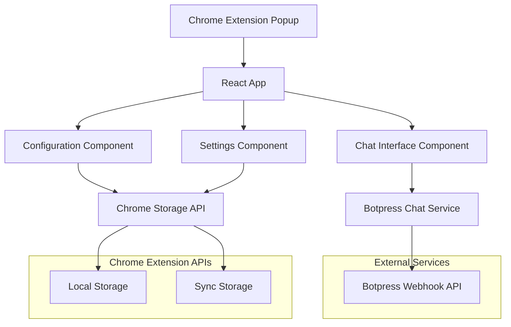
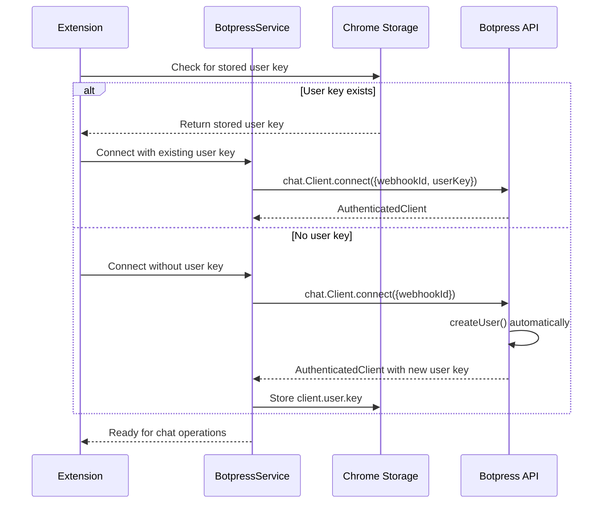
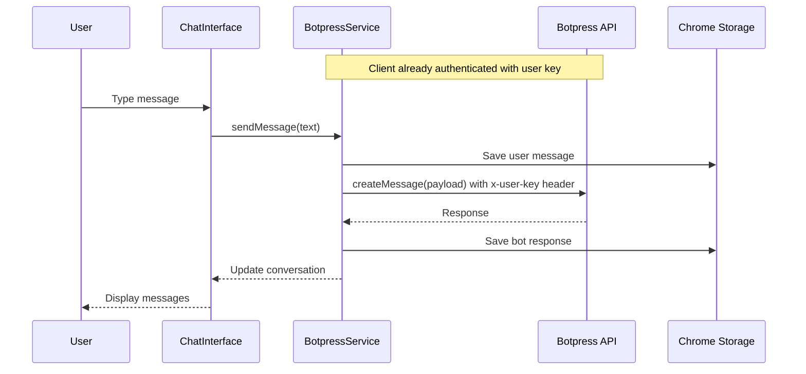

# Design Document

## Overview

This design document outlines the architecture for enhancing the existing Chrome extension with a comprehensive Botpress webhook integration. The current implementation already includes the `@botpress/chat` SDK and basic connection logic, which we'll build upon to create a full-featured chat interface with configuration management, conversation persistence, and proper error handling.

The design leverages the existing React 18.3.1 + TypeScript + Vite stack while adding new components for chat functionality, configuration management, and Chrome extension storage integration.

## Architecture

### High-Level Architecture



### Component Architecture

The application will be restructured into a modular component architecture:

- **App Component**: Main container with routing between chat and configuration views
- **ChatInterface Component**: Main chat UI with message display and input
- **ConfigurationPanel Component**: Webhook and authentication settings
- **MessageList Component**: Scrollable conversation history
- **MessageInput Component**: Text input with send functionality
- **SettingsPanel Component**: Additional options and conversation management

### State Management

The application will use React's built-in state management with custom hooks:

- **useBotpressChat**: Manages chat state, message sending, and conversation handling
- **useConfiguration**: Handles webhook configuration and validation
- **useStorage**: Abstracts Chrome extension storage operations
- **useConversation**: Manages conversation persistence and history

## Components and Interfaces

### Core Interfaces

```typescript
interface BotpressConfig {
  webhookId: string;
  apiUrl?: string;
  isConfigured: boolean;
}

interface BotpressUserSession {
  userKey: string;
  userId?: string;
  createdAt: Date;
  lastUsed: Date;
}

interface ChatMessage {
  id: string;
  type: 'user' | 'bot';
  content: string;
  timestamp: Date;
  status: 'sending' | 'sent' | 'error';
}

interface ConversationState {
  id?: string;
  messages: ChatMessage[];
  isLoading: boolean;
  error?: string;
  userSession?: BotpressUserSession;
}

interface StorageData {
  config: BotpressConfig;
  userSession?: BotpressUserSession;
  conversations: Record<string, ChatMessage[]>;
  activeConversationId?: string;
}
```

### Component Specifications

#### ChatInterface Component
- **Purpose**: Main chat interface with message display and input
- **Props**: `config: BotpressConfig`, `onConfigurationNeeded: () => void`
- **State**: Current conversation, loading states, error handling
- **Key Features**: 
  - Real-time message display
  - Auto-scroll to latest messages
  - Loading indicators during API calls
  - Error handling with retry options

#### ConfigurationPanel Component
- **Purpose**: Webhook configuration and authentication setup
- **Props**: `onConfigurationSaved: (config: BotpressConfig) => void`
- **State**: Form data, validation errors, save status
- **Key Features**:
  - Webhook URL validation
  - Secure credential storage
  - Configuration testing
  - Import/export settings

#### MessageList Component
- **Purpose**: Scrollable list of conversation messages
- **Props**: `messages: ChatMessage[]`, `isLoading: boolean`
- **Key Features**:
  - Virtual scrolling for performance
  - Message status indicators
  - Rich content rendering
  - Timestamp display

#### MessageInput Component
- **Purpose**: Text input with send functionality
- **Props**: `onSendMessage: (text: string) => void`, `disabled: boolean`
- **State**: Input text, send status
- **Key Features**:
  - Enter key handling
  - Character limits
  - Send button state management
  - Input validation

## Authentication Architecture

### User Session Management

The extension implements persistent user authentication using the Botpress Chat API's user key system. This ensures that conversations can be loaded and continued across browser sessions.

#### Authentication Strategy

1. **First-Time Connection**
   - Connect to Botpress without user key: `chat.Client.connect({ webhookId })`
   - Botpress automatically creates new user via `createUser()` API
   - Store returned `client.user.key` in Chrome sync storage
   - Use authenticated client for all subsequent operations

2. **Returning User Connection**
   - Retrieve stored user key from Chrome sync storage
   - Connect with existing key: `chat.Client.connect({ webhookId, userKey })`
   - If key is valid, get authenticated client for existing user
   - If key is invalid, fall back to creating new user

3. **Session Persistence**
   - User key stored securely in Chrome sync storage
   - Session data includes creation time and last used timestamp
   - Automatic cleanup of expired or invalid sessions

#### Error Recovery

- **Invalid User Key**: Create new user session and inform user
- **Network Errors**: Retry with exponential backoff
- **Storage Errors**: Fall back to session-only mode
- **Authentication Failures**: Clear stored session and create new user

### Service Layer Architecture

The `BotpressService` class manages the authenticated client lifecycle:

```typescript
class BotpressService {
  private client?: AuthenticatedClient;
  private userSession?: BotpressUserSession;
  
  async connect(config: BotpressConfig): Promise<void> {
    const storedSession = await this.getStoredUserSession();
    
    if (storedSession) {
      // Try to connect with existing user key
      try {
        this.client = await chat.Client.connect({
          webhookId: config.webhookId,
          userKey: storedSession.userKey
        });
        await this.updateSessionLastUsed(storedSession);
      } catch (error) {
        // Fall back to creating new user
        await this.createNewUserSession(config);
      }
    } else {
      // First time connection - create new user
      await this.createNewUserSession(config);
    }
  }
  
  private async createNewUserSession(config: BotpressConfig): Promise<void> {
    this.client = await chat.Client.connect({
      webhookId: config.webhookId
    });
    
    const userSession: BotpressUserSession = {
      userKey: this.client.user.key,
      userId: this.client.user.id,
      createdAt: new Date(),
      lastUsed: new Date()
    };
    
    await this.storeUserSession(userSession);
    this.userSession = userSession;
  }
}
```

## Data Models

### User Authentication Flow



### Message Flow Architecture



### Storage Schema

The Chrome extension will use both local and sync storage:

**Local Storage** (for conversation history):
```json
{
  "conversations": {
    "conv_123": [
      {
        "id": "msg_1",
        "type": "user",
        "content": "Hello",
        "timestamp": "2024-01-01T10:00:00Z",
        "status": "sent"
      }
    ]
  },
  "activeConversationId": "conv_123"
}
```

**Sync Storage** (for configuration and user session):
```json
{
  "config": {
    "webhookId": "webhook_123",
    "apiUrl": "https://chat.botpress.cloud",
    "isConfigured": true
  },
  "userSession": {
    "userKey": "encrypted_user_key_from_botpress",
    "userId": "user_123",
    "createdAt": "2024-01-01T10:00:00Z",
    "lastUsed": "2024-01-01T12:00:00Z"
  }
}
```

## Error Handling

### Error Categories and Responses

1. **Configuration Errors**
   - Invalid webhook URL format
   - Missing webhook ID
   - Connection failures to Botpress API
   - Response: Clear error messages with correction guidance

2. **Authentication Errors**
   - Invalid or expired user key
   - User session corruption
   - Failed user creation
   - Response: Automatic fallback to new user creation with user notification

3. **Network Errors**
   - Connection timeouts
   - API rate limiting
   - Service unavailability
   - Response: Retry mechanisms with exponential backoff

4. **Storage Errors**
   - Quota exceeded
   - Permission denied
   - Data corruption
   - Response: Graceful degradation to session storage

5. **Validation Errors**
   - Empty messages
   - Invalid message formats
   - Character limits exceeded
   - Response: Input validation with user feedback

### Error Recovery Strategies

- **Automatic Retry**: Network requests with exponential backoff
- **Graceful Degradation**: Fall back to basic functionality when advanced features fail
- **User Notification**: Clear, actionable error messages
- **State Recovery**: Restore previous working state when possible

## Testing Strategy

### Unit Testing Approach

1. **Component Testing**
   - React Testing Library for component behavior
   - Mock Botpress API responses
   - Test user interactions and state changes
   - Accessibility testing with jest-axe

2. **Service Testing**
   - Mock Chrome extension APIs
   - Test error handling scenarios
   - Validate storage operations
   - Test message formatting and validation

3. **Integration Testing**
   - End-to-end conversation flows
   - Configuration persistence
   - Error recovery scenarios
   - Cross-browser compatibility

### Test Coverage Requirements

- **Components**: 90% coverage for UI components
- **Services**: 95% coverage for business logic
- **Error Handling**: 100% coverage for error scenarios
- **Storage Operations**: 100% coverage for data persistence

### Testing Tools and Setup

- **Jest**: Unit test runner
- **React Testing Library**: Component testing
- **MSW (Mock Service Worker)**: API mocking
- **Chrome Extension Testing**: Mock chrome APIs
- **Accessibility Testing**: jest-axe integration

## Security Considerations

### Data Protection

1. **Credential Storage**
   - Use Chrome's secure storage APIs
   - Encrypt sensitive data before storage
   - Implement proper key management
   - Regular credential rotation prompts

2. **API Communication**
   - HTTPS-only communication
   - Proper authentication headers
   - Request/response validation
   - Rate limiting compliance

3. **Content Security Policy**
   - Restrict external resource loading
   - Prevent XSS attacks
   - Validate all user inputs
   - Sanitize bot responses

### Privacy Considerations

- **Data Minimization**: Store only necessary conversation data
- **User Consent**: Clear privacy policy for data usage
- **Data Retention**: Automatic cleanup of old conversations
- **Export/Delete**: User control over their data

## Performance Optimization

### Rendering Performance

- **Virtual Scrolling**: For large conversation histories
- **Message Batching**: Group rapid messages for efficient rendering
- **Lazy Loading**: Load conversation history on demand
- **Memoization**: Prevent unnecessary re-renders

### Storage Optimization

- **Data Compression**: Compress stored conversation data
- **Cleanup Strategies**: Remove old conversations automatically
- **Efficient Queries**: Optimize storage read/write operations
- **Caching**: Cache frequently accessed data

### Network Optimization

- **Request Debouncing**: Prevent rapid API calls
- **Connection Pooling**: Reuse Botpress connections
- **Offline Handling**: Queue messages when offline
- **Progressive Loading**: Load essential features first