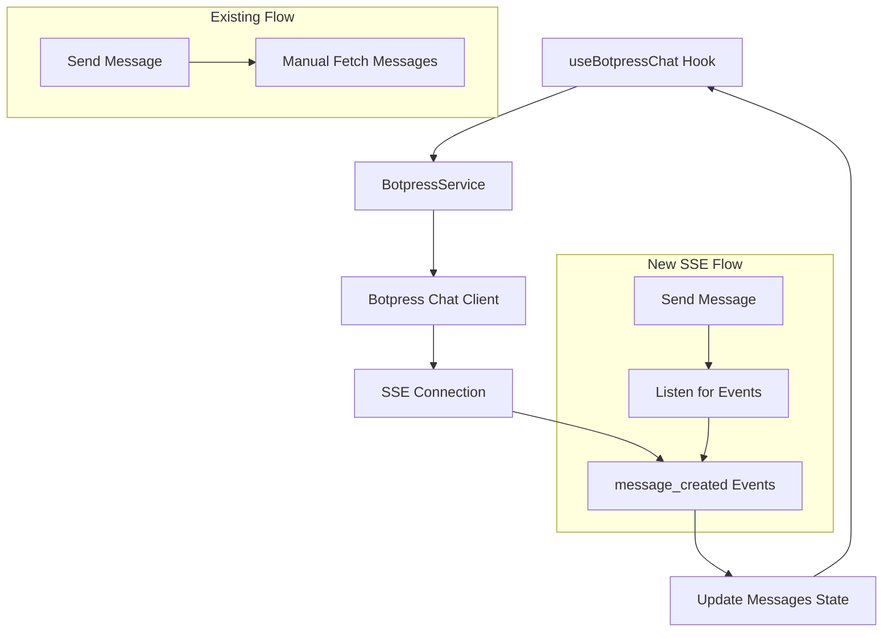

# Design Document

## Overview

This design document outlines a simple implementation for adding Server-Sent Events (SSE) to the existing Botpress chat integration. The approach focuses on minimal changes to the current architecture while adding real-time message streaming using the Botpress Chat API's `listenConversation` method.

The design leverages the existing `useBotpressChat` hook and `BotpressService` class, adding SSE functionality without major refactoring.

## Architecture

### High-Level Architecture



### Integration Points

The SSE implementation will integrate at two key points:

1. **BotpressService**: Add SSE listener management methods
2. **useBotpressChat Hook**: Add SSE event handling to update messages state

## Components and Interfaces

### Enhanced BotpressService Interface

```typescript
class BotpressService {
  private listener: SignalListener | null = null;
  
  // New SSE methods
  async startListening(conversationId: string, onMessage: (message: ChatMessage) => void): Promise<void>
  async stopListening(): Promise<void>
  
  // Existing methods remain unchanged
  async sendMessage(conversationId: string, content: string): Promise<{...}>
  async getMessages(conversationId: string): Promise<{...}>
  // ... other existing methods
}
```

### Enhanced useBotpressChat Hook

```typescript
interface UseBotpressChatReturn {
  // Existing properties remain the same
  messages: ChatMessage[];
  isLoading: boolean;
  // ... other existing properties
  
  // New property for SSE status
  isListening: boolean;
  
  // Existing methods remain the same
  sendMessage: (content: string, pageContext?: PageContent) => Promise<void>;
  // ... other existing methods
}
```

### SSE Event Handling

The implementation will focus on the `message_created` event from the Botpress Chat API:

```typescript
listener.on('message_created', (event) => {
  const message: ChatMessage = {
    id: event.id,
    type: event.isBot ? 'bot' : 'user',
    content: event.payload.type === 'text' ? event.payload.text : '[Non-text message]',
    timestamp: new Date(event.createdAt)
  };
  
  // Add to messages state
  onMessage(message);
});
```

## Data Models

### No Changes to Existing Models

The existing `ChatMessage` interface and other data models remain unchanged:

```typescript
interface ChatMessage {
  id: string;
  type: 'user' | 'bot';
  content: string;
  timestamp: Date;
  pageContext?: {
    url: string;
    title: string;
  };
}
```

### New SSE State

Only one new piece of state is added to track SSE connection status:

```typescript
interface ChatState {
  // Existing state properties
  messages: ChatMessage[];
  isLoading: boolean;
  error: string | null;
  conversationId: string | null;
  isConfigured: boolean;
  
  // New SSE state
  isListening: boolean;
}
```

## Error Handling

### Simple Error Strategy

1. **Connection Errors**: Log the error and continue with existing functionality
2. **Event Parsing Errors**: Ignore malformed events, continue listening
3. **Network Issues**: Let the Botpress SDK handle reconnection automatically

### Fallback Behavior

If SSE fails or is unavailable:
- Continue using the existing `getMessages()` approach
- No user-visible changes to functionality
- Log SSE errors for debugging

## Testing Strategy

### Unit Tests

1. **BotpressService SSE Methods**
   - Test `startListening()` establishes connection
   - Test `stopListening()` cleans up properly
   - Test message event handling

2. **useBotpressChat Hook**
   - Test SSE integration with existing message flow
   - Test state updates when SSE events are received
   - Test fallback when SSE is unavailable

### Integration Tests

1. **End-to-End Message Flow**
   - Send message and verify it appears via SSE
   - Test conversation switching with SSE
   - Test cleanup when component unmounts

## Implementation Approach

### Phase 1: Add SSE to BotpressService

1. Add SSE listener management methods
2. Implement `message_created` event handling
3. Add proper cleanup on service destruction

### Phase 2: Integrate with useBotpressChat Hook

1. Add SSE state management
2. Start listening when conversation is active
3. Update message state from SSE events
4. Stop manual message fetching when SSE is active

### Phase 3: Handle Edge Cases

1. Conversation switching
2. Component cleanup
3. Error handling and fallback

## Security Considerations

### Minimal Security Impact

Since this uses the existing Botpress Chat API authentication:
- No new authentication mechanisms needed
- Uses existing user key for SSE connection
- No additional security considerations beyond current implementation

## Performance Optimization

### Efficient Implementation

1. **Single Connection**: One SSE connection per active conversation
2. **Automatic Cleanup**: Disconnect when conversation changes or component unmounts
3. **Event Filtering**: Only handle `message_created` events initially
4. **Memory Management**: Proper event listener cleanup

### Resource Usage

- Minimal additional memory usage (one SSE connection)
- Reduced network usage (no more manual message polling)
- Better user experience with real-time updates