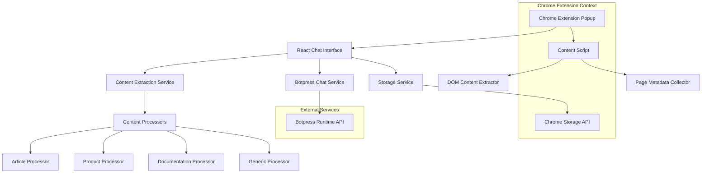
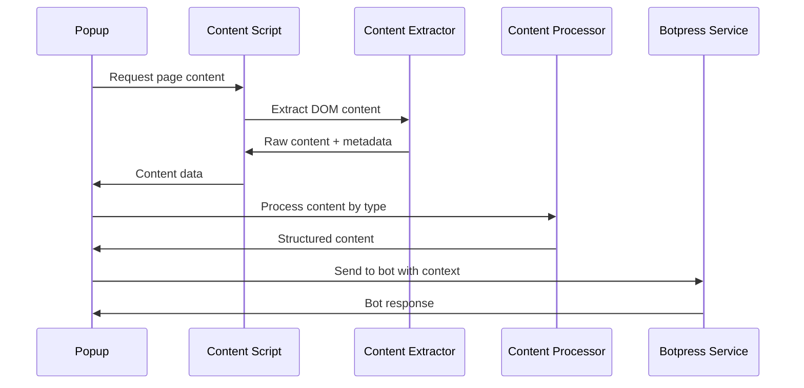

# Design Document

## Overview

This design document outlines the architecture for a Chrome extension that enables users to chat with their Botpress bot about the content of websites they're currently viewing. The extension will automatically extract webpage content, intelligently process different content types, and provide a chat interface where users can ask questions, request summaries, and get insights about the current page.

The system leverages Chrome extension APIs for content extraction and tab management, the existing Botpress chat SDK for bot communication, and React for the user interface.

## Architecture

### High-Level Architecture



### Content Extraction Flow



### Component Architecture

The application will consist of these main components:

- **ChatInterface**: Main chat UI with content preview
- **ContentExtractor**: Service for extracting webpage content
- **ContentProcessor**: Intelligent processing based on page type
- **SuggestedQuestions**: Dynamic question suggestions
- **ConfigurationPanel**: Botpress setup and settings
- **ConversationHistory**: Previous chats tied to URLs

## Components and Interfaces

### Core Interfaces

```typescript
interface BotpressConfig {
  token: string; // Personal Access Token
  botId: string;
  isConfigured: boolean;
}

interface PageContent {
  url: string;
  title: string;
  domain: string;
  contentType: 'article' | 'product' | 'documentation' | 'blog' | 'generic';
  extractedText: string;
  metadata: PageMetadata;
  extractedAt: Date;
}

interface PageMetadata {
  author?: string;
  publishDate?: string;
  description?: string;
  keywords?: string[];
  images?: string[];
  headings?: string[];
  links?: string[];
}

interface ContentExtractionResult {
  success: boolean;
  content?: PageContent;
  error?: string;
  suggestions?: string[];
}

interface ChatMessage {
  id: string;
  type: 'user' | 'bot' | 'system';
  content: string;
  timestamp: Date;
  pageContext?: {
    url: string;
    title: string;
  };
}

interface ConversationSession {
  id: string;
  url: string;
  title: string;
  messages: ChatMessage[];
  conversationId?: string; // Botpress conversation ID
  createdAt: Date;
  lastActivity: Date;
}
```

### Component Specifications

#### ContentExtractor Service
- **Purpose**: Extract and process webpage content using Chrome extension APIs
- **Key Methods**:
  - `extractCurrentPageContent(): Promise<ContentExtractionResult>`
  - `detectContentType(content: string, metadata: PageMetadata): ContentType`
  - `processContentByType(content: string, type: ContentType): ProcessedContent`
- **Chrome APIs Used**: `chrome.tabs`, `chrome.scripting`

#### BotpressService
- **Purpose**: Handle communication with Botpress runtime API using @botpress/client
- **Key Methods**:
  - `createConversation(): Promise<string>` - Create new conversation
  - `sendMessage(conversationId: string, content: string, pageContext: PageContent): Promise<void>`
  - `getMessages(conversationId: string): Promise<ChatMessage[]>`
  - `listConversations(): Promise<ConversationSession[]>`
- **Authentication**: Uses Personal Access Token (PAT) and bot ID

#### ContentProcessor Classes
- **ArticleProcessor**: Extracts headlines, author, date, main content
- **ProductProcessor**: Extracts product name, price, description, reviews
- **DocumentationProcessor**: Extracts headings, code blocks, explanations
- **BlogProcessor**: Extracts title, author, content, tags
- **GenericProcessor**: Fallback for unidentified content types

#### ChatInterface Component
- **Purpose**: Main chat interface with content preview and suggestions
- **Props**: `pageContent: PageContent`, `botConfig: BotpressConfig`
- **State**: Current conversation, loading states, suggested questions
- **Key Features**:
  - Content preview panel
  - Suggested question buttons
  - Real-time chat with context
  - Tab change detection

#### SuggestedQuestions Component
- **Purpose**: Generate and display contextual question suggestions
- **Props**: `contentType: ContentType`, `pageContent: PageContent`
- **Logic**: Dynamic question generation based on content analysis
- **Examples**:
  - Articles: "Summarize the main points", "Who is mentioned in this article?"
  - Products: "What are the key features?", "How does this compare to alternatives?"
  - Documentation: "Explain the main concepts", "Show me code examples"

## Data Models

### Content Extraction Strategy

The system will use a multi-layered approach to content extraction:

1. **DOM Analysis**: Identify content structure using semantic HTML
2. **Content Type Detection**: Analyze page structure and metadata
3. **Intelligent Extraction**: Apply type-specific extraction rules
4. **Content Optimization**: Truncate and format for API consumption

### Content Type Detection Rules

```typescript
const contentTypeRules = {
  article: {
    indicators: ['article', 'main', '.post-content', '.article-body'],
    metadata: ['author', 'published', 'article:author'],
    structure: 'headline + body paragraphs'
  },
  product: {
    indicators: ['.product', '.item', '[data-product]'],
    metadata: ['price', 'rating', 'availability'],
    structure: 'title + price + description + reviews'
  },
  documentation: {
    indicators: ['.docs', '.documentation', 'main.content'],
    metadata: ['section', 'version', 'api'],
    structure: 'headings + code blocks + explanations'
  }
};
```

### Storage Schema

**Local Storage** (for conversation history):
```json
{
  "conversations": {
    "conv_123": {
      "id": "conv_123",
      "url": "https://example.com/article",
      "title": "Example Article",
      "messages": [...],
      "createdAt": "2024-01-01T10:00:00Z",
      "lastActivity": "2024-01-01T10:30:00Z"
    }
  },
  "currentSession": "conv_123"
}
```

**Sync Storage** (for configuration):
```json
{
  "botpressConfig": {
    "token": "encrypted_pat_token",
    "botId": "bot_123",
    "isConfigured": true
  },
  "extractionSettings": {
    "maxContentLength": 5000,
    "includeImages": false,
    "includeLinks": true
  }
}
```

## Chrome Extension Integration

### Manifest V3 Configuration

```json
{
  "manifest_version": 3,
  "permissions": [
    "activeTab",
    "scripting",
    "storage"
  ],
  "host_permissions": [
    "http://*/*",
    "https://*/*"
  ],
  "content_scripts": [
    {
      "matches": ["<all_urls>"],
      "js": ["content-script.js"],
      "run_at": "document_idle"
    }
  ]
}
```

### Content Script Implementation

The content script will:
- Extract DOM content when requested
- Monitor for dynamic content changes
- Provide page metadata and structure analysis
- Handle different page types and frameworks

### Background Script (if needed)

For tab management and cross-tab communication:
- Track active tab changes
- Manage content extraction requests
- Handle permission requests

## Error Handling

### Content Extraction Errors

1. **Permission Denied**
   - Fallback: Manual URL input
   - User guidance: Permission explanation

2. **Content Not Found**
   - Fallback: Generic text extraction
   - User notification: Limited analysis available

3. **Large Content**
   - Strategy: Intelligent truncation
   - User option: Manual content selection

4. **Dynamic Content**
   - Strategy: Wait and retry
   - Timeout: 5 seconds with fallback

### Bot Communication Errors

1. **API Limits Exceeded**
   - Strategy: Content summarization
   - User notification: Reduced context sent

2. **Network Failures**
   - Strategy: Retry with exponential backoff
   - Fallback: Offline mode with cached responses

3. **Authentication Errors**
   - Action: Redirect to configuration
   - User guidance: Credential verification

## Testing Strategy

### Content Extraction Testing

1. **Multi-Site Testing**
   - Test on various website types (news, e-commerce, docs, blogs)
   - Validate content type detection accuracy
   - Test extraction quality and completeness

2. **Dynamic Content Testing**
   - Single Page Applications (SPAs)
   - Lazy-loaded content
   - Infinite scroll pages

3. **Edge Case Testing**
   - Password-protected pages
   - Pages with heavy JavaScript
   - Mobile-responsive layouts

### Integration Testing

1. **Chrome Extension APIs**
   - Tab management and permissions
   - Content script communication
   - Storage operations

2. **Botpress Integration**
   - Message sending with context
   - Response handling and display
   - Error scenarios and recovery

### Performance Testing

1. **Content Extraction Speed**
   - Large page handling
   - Multiple tab scenarios
   - Memory usage optimization

2. **Chat Response Times**
   - With various content sizes
   - Network condition variations
   - Concurrent user scenarios

## Security Considerations

### Content Privacy

1. **Sensitive Content Detection**
   - Identify personal information, passwords, private data
   - User consent before sending sensitive content
   - Option to exclude sensitive domains

2. **Data Minimization**
   - Send only relevant content portions
   - Strip unnecessary metadata
   - Implement content filtering

### API Security

1. **Secure Communication**
   - HTTPS-only requests to Botpress
   - Proper authentication headers
   - Request/response validation

2. **Credential Protection**
   - Encrypted storage of API keys
   - Secure credential transmission
   - Regular credential rotation prompts

## Performance Optimization

### Content Extraction Optimization

1. **Efficient DOM Parsing**
   - Use native browser APIs
   - Minimize DOM traversal
   - Cache extraction results

2. **Content Processing**
   - Lazy loading of processors
   - Parallel processing where possible
   - Smart content truncation

### Chat Performance

1. **Message Optimization**
   - Debounce user input
   - Batch multiple requests
   - Cache common responses

2. **Storage Optimization**
   - Compress conversation data
   - Implement storage cleanup
   - Efficient query patterns

### Memory Management

1. **Content Script Cleanup**
   - Remove event listeners
   - Clear cached content
   - Minimize persistent data

2. **Popup Optimization**
   - Lazy component loading
   - Efficient re-rendering
   - Memory leak prevention